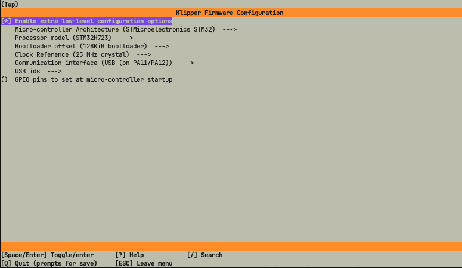
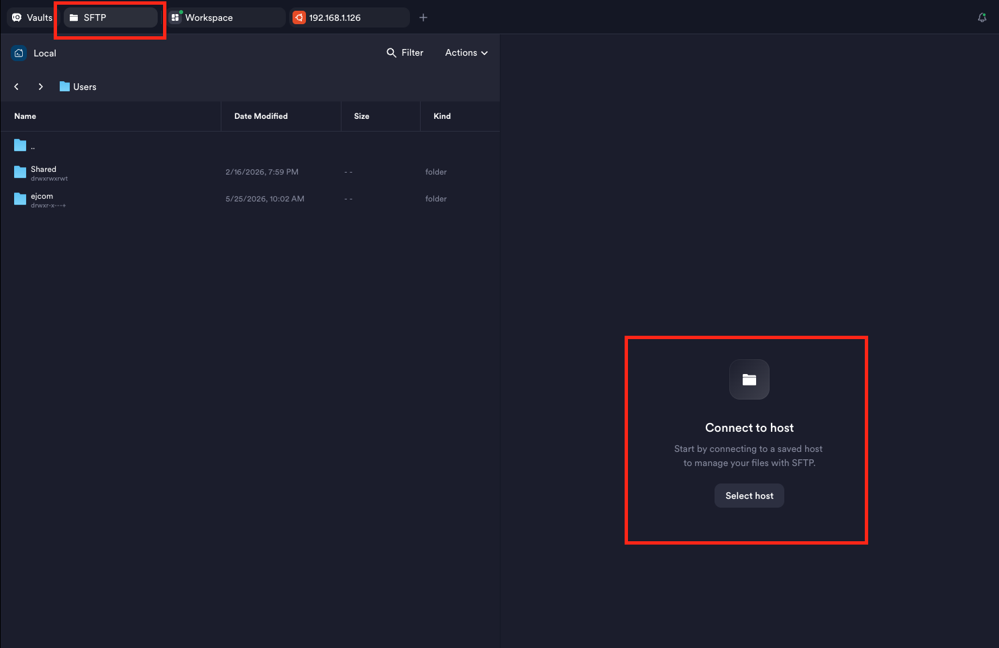

### Прошивка BTT Octopus H723 v1.1 с подключением USB/Type-C

**Во избежание проблем с включением нагревателей во время прошивки, лучше сделать это до установки платы в принтер.**

1. Понадобится SD карта для октопуса, usb картридер.
2. Для удобства ставим себе Terminus https://termius.com/, Подключаемся к хосту по SSH, делаем следующее:

```
sudo apt update
sudo apt install make
cd ~/klipper/
make clean
make menuconfig
```
3. Настраиваем параметры:
* Enable extra low-level configuration options - `вкл`
* Micro-controller architecture - `STMicroelectronics STM32`
* Processor model - `STM32H723`
* Bootloader offset - `128KiB bootloader`
* Clock Reference - `25MHz crystal`
* Communication interface - `USB (on PA11/PA12)`



4. Жмем Q для выхода, Y соглашаемся с изменениями
5. Запускаем сборку командой
```
make
```
6. Цепляем SD карту к компу удобным способом, форматируем в `FAT32`
7. Цепляемся к хосту по SFTP



8. Идем в папку
```
/home/<имя юзера для клиппера>/klipper/klipper/out
```
9. Перекидываем на SD карту файл `klipper.bin`, переименовываем в `firmware.bin`
10. Безопасно извлекаем SD карту, втыкаем ее в выключенный октопус, цепляем его к хосту по usb/type-c (подаем питание).

После успешной прошивки файл на SD карте переименуется. В терминале хоста выполняем
```
ls /dev/serial/by-id
```
Результат должен быть такого вида:
```
usb-Klipper_stm32h723xx_120026000A51333231343036-if00
```

11. Ставим плату в принтер.